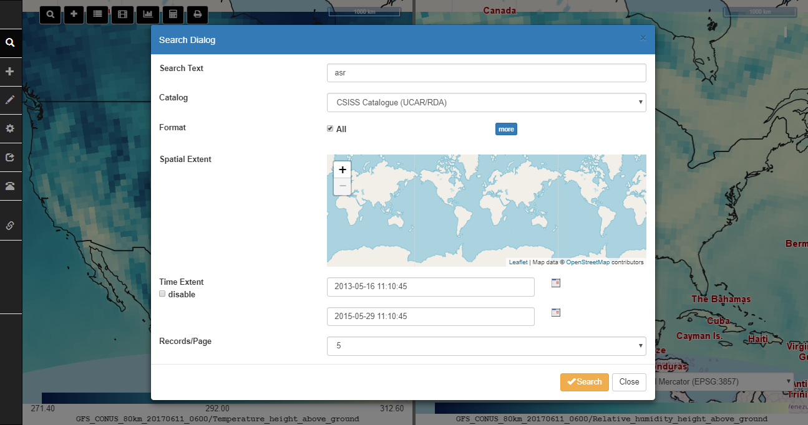
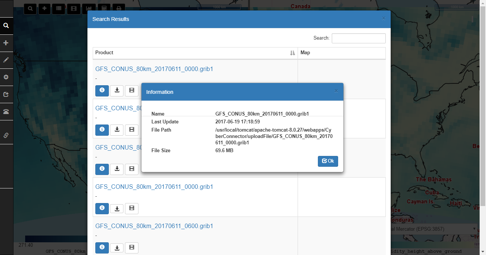

[](https://travis-ci.org/CSISS/cc) [](https://github.com/CSISS/cc/blob/master/LICENSE) [](https://github.com/CSISS/cc/stargazers) [](https://github.com/CSISS/cc/network/members) [](https://github.com/CSISS/cc/issues) [](https://codecov.io/) 

# CyberConnector

NSF EarthCube Building Block project

This project aims to connect the existing data sources to the Earth science models so the generation of modeling products could be more automatic and effortless. 

[CyberConnector Online Documentation](https://csiss.github.io/cc/)

# Installation

## Prerequisite

Java 1.8+ (mandatory, OpenJDK)

Apache Tomcat 8.0+ (mandatory, web container)

MySQL 5.5+ (mandatory, database, initialize it with db/cc.empty.sql)

ncWMS 2.4.1+ (mandatory, download ncWMS.war and deploy it into Tomcat webapps folder)

[cc-thredds-pycsw](https://github.com/CSISS/cc-thredds-pycsw) (optional, if you plan to set up your own catalog)

Apache Maven 3.5.0+ (optional, building CyberConnector.war from source)

## Quick Start

### Automated Installer

CyberConnector installer support CentOS, Ubuntu/Debian and Mac OS X operating systems. To get started download the latest source code. The installer script requires two parameters: the Anaconda directory and the data directory paths. 


Example usage: 

```
cd install
./install.sh /opt/anaconda3 /data
```


### Java War Package

To manually deploy CyberConnector to Apache Tomcat, [download](https://github.com/CSISS/cc/releases) the latest release war and copy it to the webapps directory of Tomcat. Start Tomcat. 

After the Tomcat is fully started, configure the database connection. The configuration files are `WEB-INF/classes/config.properties` (database url, default: jdbc:mysql://localhost:3306/cyberconnector) and `WEB-INF/classes/cc_secret.properties` (database username and password: database_user=root database_password=xxxxxxxx). Fill the fields with correct values. (**Note: the database must be initiated first.**)

Then enter the following URL into browser address bar to open CyberConnector:

`http://your-ip:your-port/CyberConnector-<version>/web/CyberConnector`

Replace the `your-ip`, `your-port`, `CyberConnector-<version>` with the real name of your tomcat and downloaded CyberConnector package. For example, `localhost:8080`, `CyberConnector-0.6.6`.

### Cloud Instance Template

We provide a ready-to-use cloud template for you to install on mainstream cloud platforms like AWS, Google Cloud, Azure, OpenStack and CloudStack. Please go here to download the template.

### Docker Image

We published a Docker image in DockerHub for docker users. The pull command is:

`docker pull csiss/cyberconnector`

The run command is:

`docker run -p 8080:8080 -v DATAPATH:/covaliFiles csiss/cyberconnector`

# Modules

COVALI - a sub-system for comparison and validation of atmospheric and other Earth science models (funded by [EarthCube CyberWay](http://cube.csiss.gmu.edu/CyberWay/web/index))

CyberConnector Searcher - a sub-system for searching Earth observations, model results or virtual data products (VDP)

CyberConnector Orderer - a sub-system for orderring VDP (customizing existing observations into ready-to-use format)

CyberConnector Service Register - a sub-system for registering and searching geoprocessing web services

# Usage

## COVALI

Example: 


Animation Demo:


### Roam around the Globe


COVALI has different projection options and 3-D view to enable multi-perspective viewing the data.


### Search Data

#### search in UCAR server



#### search in the public folder


Search results are listed in a panel where users can directly download the files or load them into the maps.



### Add Data

COVALI supports visualizing GRIB/NetCDF data on the maps. 


### Settings

COVALI provides a Settings menu to controll the two maps. It allows users to manage the added data layers.


### Tools

COVALI provides a number of tools to facilitate the comparison and validation among the data. 

#### Statistic Report

Users can draw points or lines on the map to get a statistics on the values on the points or along the lines.


#### Regridding

Regridding for NetCDF data is supported but requires additional configuration. Regridding uses ESMF (Earth Science Modeling Framework) and xESMF Python libraries.

First, [Anaconda](https://docs.anaconda.com/anaconda/install/) must be installed and it's location must be set in `config.properties` file. For example: `anaconda_path=/opt/anaconda3`  

Second, a new environment with correct dependencies must be configured:
```$bash
conda create -n esmpy8 -y
conda install -y -n esmpy8  -c conda-forge "esmf!=*nompi" esmpy xarray=0.14.1 scipy dask netCDF4 xesmf libnetcdf=4.6.2 netcdf4=1.5.1
``` 


#### Map rotation

Use `Alt+Shift+Drag` to rotate the map.


# Demo Site

A demo instance has been deployed on George Mason University server. [here](http://cube.csiss.gmu.edu/CyberConnector/web/covali)

# License

MIT

# Developers

[developer list](authors.md)

# Funders

National Science Foundation (#1740693 and #1440294)


