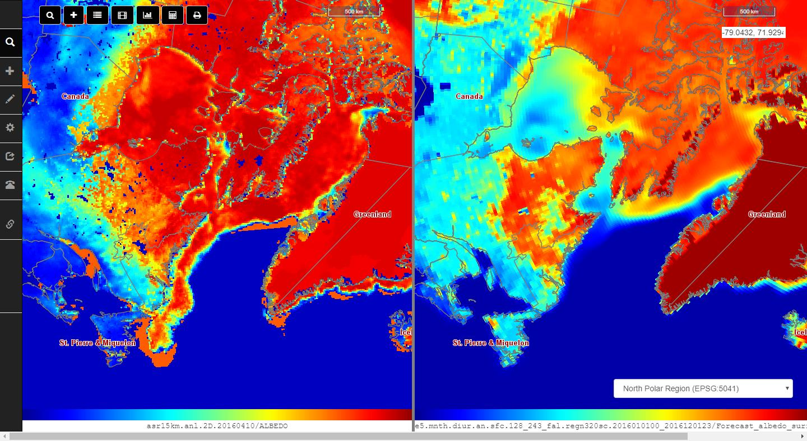
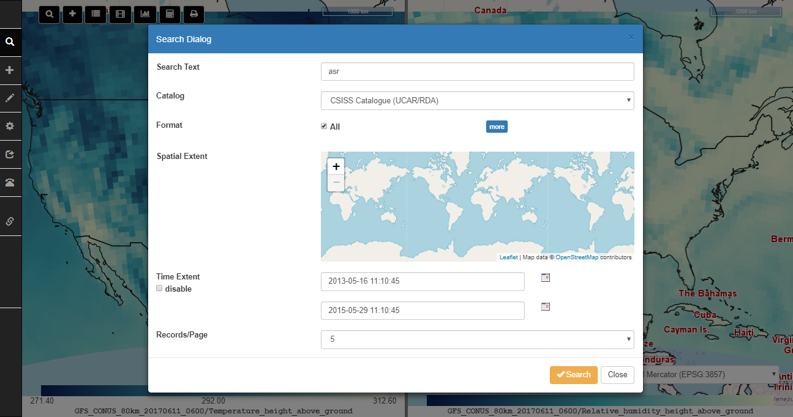
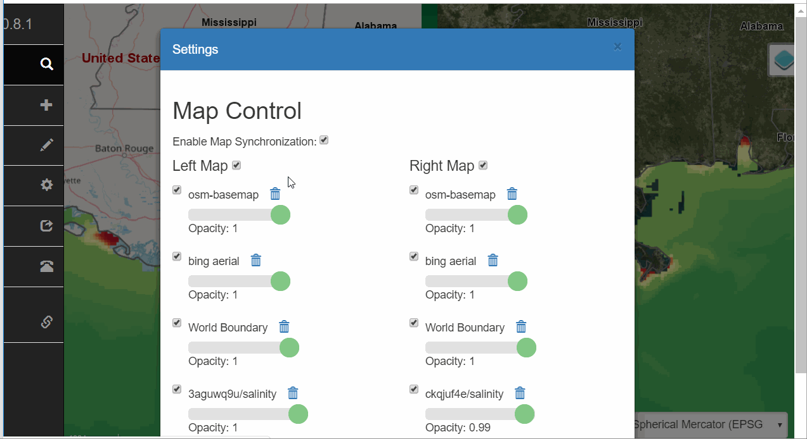
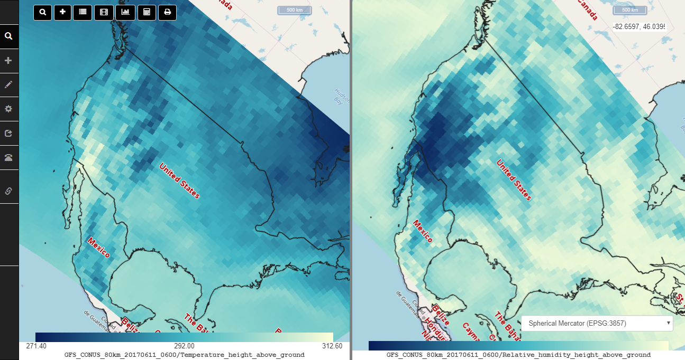
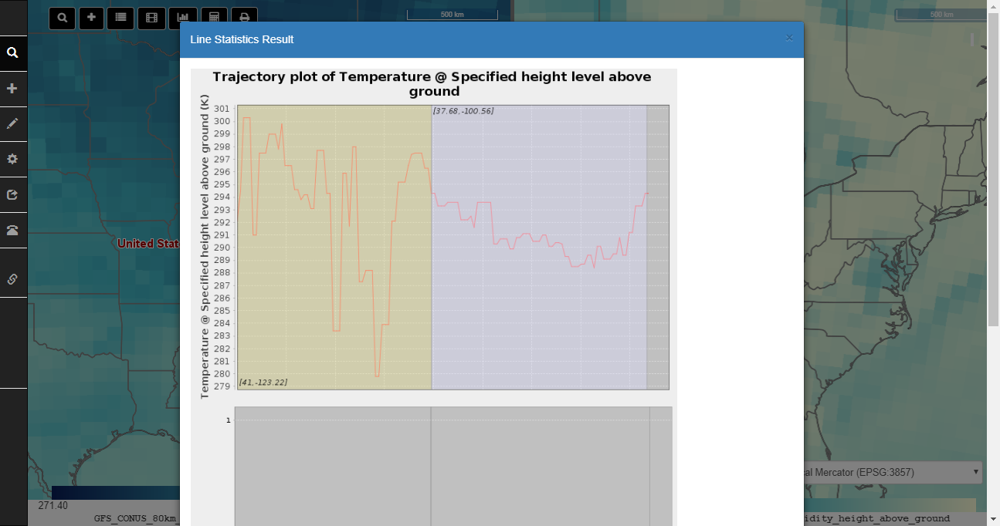

      

# 1. Introduction

NSF EarthCube Building Block project

This project aims to connect the existing data sources to the Earth science models so the generation of modeling products could be more automatic and effortless. 

## 1.1 COVALI

A sub-system for comparison and validation of Earth system science models. COVALI is the most important sub-system of CyberConnector. It can support comparison and validation of the tremendous amount of observational data or modeling data from atmospheric and other Earth science models (funded by [EarthCube CyberWay](http://cube.csiss.gmu.edu/CyberWay/web/index)). 

## 1.2 Data Searcher

A sub-system for searching Earth observations, model results or virtual data products (VDP)

## 1.3 Data Orderer

A sub-system for orderring VDP (customizing existing observations into ready-to-use format)

## 1.4 Data Register

A sub-system for registering and searching geoprocessing web services

# 2. Installation

## 2.1 Prerequisite

Java 1.8+ (mandatory, OpenJDK)

Apache Tomcat 8.0+ (mandatory, web container)

MySQL 5.5+ (mandatory, database, initialize it with db/cc.empty.sql)

ncWMS 2.4.1+ (mandatory, download ncWMS.war and deploy it into Tomcat webapps folder)

[cc-thredds-pycsw](https://github.com/CSISS/cc-thredds-pycsw) (optional, if you plan to set up your own catalog)

Apache Maven 3.5.0+ (optional, building CyberConnector.war from source)

## 2.2 Java War Package

To use CyberConnector, [download](https://github.com/CSISS/cc/releases) the latest release war and copy it to the webapps directory of Tomcat. Start Tomcat. 

After the tomcat is fully started, configure the database connection. The configuration files are `WEB-INF/classes/config.properties` (database url, default: jdbc:mysql://localhost:3306/cyberconnector) and `WEB-INF/classes/cc_secret.properties` (database username and password: database_user=root database_password=xxxxxxxx). Fill the fields with correct values. (**Note: the database must be initiated first.**)

Then enter the following URL into browser address bar to open CyberConnector:

`http://your-ip:your-port/CyberConnector-<version>/web/CyberConnector`

Replace the `your-ip`, `your-port`, `CyberConnector-<version>` with the real name of your tomcat and downloaded CyberConnector package. For example, `localhost:8080`, `CyberConnector-0.6.6`.

## 2.3 Docker Image

We published a Docker image in DockerHub for docker users. The pull command is:

`docker pull csiss/cyberconnector`

## 2.4 Cloud Instance Template

We provide a ready-to-use cloud template for you to install on mainstream cloud platforms like AWS, Google Cloud, Azure, OpenStack and CloudStack. Please go here to download the template.

# 3. Usage

## 3.1 Open Interface 

COVALI is web system. You can open it by entering "[http://cube.csiss.gmu.edu/CyberConnector/web/covali](http://cube.csiss.gmu.edu/CyberConnector/web/covali)" or "http://your-ip:your-port/CyberConnector/web/covali" in the browser. The interface of COVALI has one top toolbar, one side menu, one left map and one right map. 

The buttons in the top toolbar from left to right are "Search", "Add", "Settings", "Animation", "Statistics", "Calculation" ([NCO](http://nco.sourceforge.net/) backed processing), "Print". The functions in the top toolbar and side menu are duplicated for easy access. The default base map of the two maps is OpenStreetMap. The two maps are synchronized at the same resolution, extent, and direction. Every time users move one of them, the other one will do the same. There are two map scales on the left top of each map indicating how many actual miles one pixel is equal to. There is a dropdown selection box on the left bottom of the right map to change the map projection or switch between 2D and 3D mode. 

## 3.2 Add Data to Maps

COVALI supports visualizing GRIB/NetCDF data on the maps. 

Users have several options to add data into the maps, including:

Public: COVALI allows users to browse a public folder on the server which is configured when CyberConnector is installed. All the files in the public folder will be accessible and downloaded by the public. COVALI will be able to locate, parse and visualize the data on either of the two maps. After you click the corresponding "Choose" button, a new dialog listing "cc_cache" and "uploadFile" will show up. The "cc_cache" is the public folder, the "uploadFile" is the folder which holds all the uploaded files from the public. Click either of them will show all the files within it. Click on any data file with specific format suffix, e.g., grib and nc (netcdf), COVALI will automatically locate the file and parse its metadata. If the parsing is complete, a new window will pop up to ask if you "want to load it into the map now?" Click "Load" button will give you a list of variables which you can display. You can also choose the rendering style, time step, and elevation/depth value of the variable. Click on either "Add to Left" or "Add to Right" button to load the variable into the respective map. 

WMS (Web Map Service) (support version 1.3.0): COVALI depends on ncWMS. Users can use the built-in ncWMS which was installed on the same server by selecting the "Built-in ncWMS" option. If you want to use other WMS, we strongly recommand ncWMS-backed WMS which is best supported by COVALI at present. You need input the WMS capability document URL into the field, and click "Add" button next to it. COVALI will start to parse the WMS document and will list all the layers contained in the WMS if the parsing is successful. The rest variable selection and loading is the same as the "Public" option.

Upload: COVALI also allows users to upload data files from their machines. Users must agree the service terms by clicking the "Agree" checkbox before they are allowed to click "Open Upload Window". Once the term is accepted and the upload window pops up, click "Choose File" in the window to choose local files and click "Upload". Don't close the COVALI web page and the upload page at the uploading. Once it says the uploading is complete, click "Load" button and COVALI will start to parse the uploaded file. The rest loading steps will be the same as "Public" option. If you accidentally closed the COVALI web page, you could find your uploaded files in the "uploadfiles" folder in the "Public" option.

File URL: COVALI allows users to ask COVALI to download data files from URL. Once you click the "File URL" option, you will be able to input file URLs into the blank field. Once a URL is filled, click the "Cache" button next to it. COVALI will download the file into the "upload folder". The "Cache" button will go gray during the downloading. It means you cannot cache multiple files at the same time to prevent confusion. Once it notifys the file is cached, click on the button "Load Map" and the rest steps are the usual. 

CHORDS URL: Besides GRIB and NetCDF files, COVALI can also load real time stationary data. CHORDS is a real time data streaming system which is deployed on cloud and can capture real time observations from field sensors (e.g., 3D printed low-cost sensors) and store them into database. They have a official demo site which you can choose by checking the "CHORDS official instance" option and the filed will be automatically filled by its portal entry link. Click "Add" button and the sensors of CHORDS will be labelled on both maps. Clicking on the sensor lables will give information like sensor name, sensor device model, geolocation, the latest observations, etc, which can be used to validation the results from climate models. 

IRIS: Similar with CHORDS, COVALI can load the sensor network of [IRIS (Incorporated Research Institutions for Seismology)](https://www.iris.edu/hq/). It can visualize the distribution of IRIS sensor networks and clicking on each sensor will give the observation data captured by the sensor. 

## 3.3 Roaming

After the data is loaded, users can browse and compare the data in details from whatever scales and angles they think will help understand the data. COVALI has different projection options and 3-D view to enable multi-perspective viewing the data. Users can switch projection or dimension by clicking the selection button at the right-bottom. 

## 3.4 Search Data

### 3.4.1 search in UCAR server

COVALI integrates a catalog service which hosts the metadata of ASR (Arctic System Reanalysis) products. Users can choose the "CSISS Catalogue (UCAR/RDA)" in the field of catalog to search. The search function allows users to specify their interested spatial extent and temporal period to narrow down to their interest data. 

### 3.4.2 search in the public folder

COVALI supports searching among the local files stored in the public folder and the upload_file folder. Notice: the spatial and temporal filters are not working for local files (because there is no metadata).

Search results are listed in a panel where users can directly download the files or load them into the maps.

## 3.5 Settings

COVALI provides a Settings menu to controll the two maps. It allows users to manage the added data layers. They can adjust the opacity of the layers, change the order of the layers, change the legend/style of the layers (by clicking on the legend at the bottom of each map). They can also switch layers between the two maps by clicking the "switch map" button after the layer name in the "Settings" window. Users can also download the corresponding original data files by clicking the "Download" button. 

### 3.5.1 Map Synchronization

Users can also disconnect them by clicking "Settings" -> "Map Control" -> uncheck "Enable Map Synchronization". After disconnected, the two maps will no longer move together so users can observe the two maps at different scale and location. Check the box will make them synchronize again on next move.

### 3.5.2 Map rotation

Use `Alt+Shift+Drag` to rotate the map.

## 3.6 Tools

COVALI provides a number of tools to facilitate the comparison and validation among the data. 

### 3.6.1 Statistic Report

Users can draw points or lines on the map to get a statistics on the values on the points or along the lines.

# 4. Demo Site

A demo instance has been deployed on George Mason University server. [here](http://cube.csiss.gmu.edu/CyberConnector/web/covali)

# 5. License

MIT

# 6. Developers

[developer list](https://github.com/CSISS/cc/graphs/contributors)

# 7. Funders

This project is initially funded by National Science Foundation (#1740693 and #1440294). 

